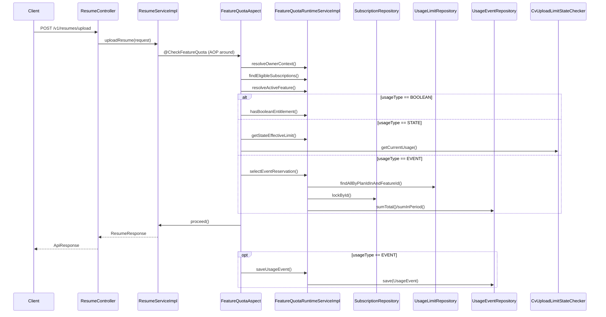
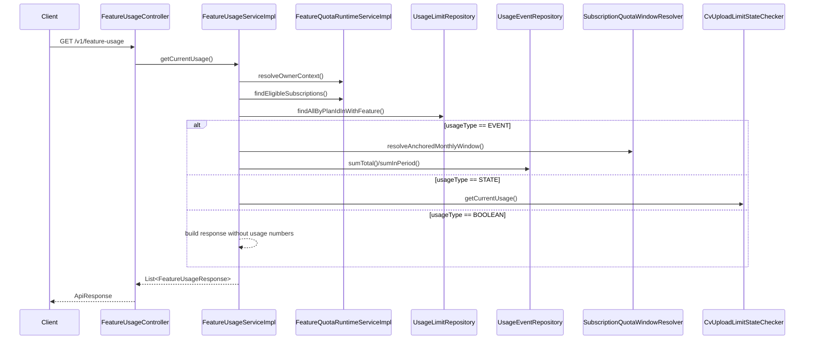

# Feature Usage Sequence

## Quota Check And Usage Deduction (Annotated Methods)

```mermaid
sequenceDiagram
    participant Client
    participant Controller as ResumeController
    participant Service as ResumeServiceImpl
    participant Aspect as FeatureQuotaAspect
    participant Runtime as FeatureQuotaRuntimeServiceImpl
    participant SubRepo as SubscriptionRepository
    participant LimitRepo as UsageLimitRepository
    participant EventRepo as UsageEventRepository
    participant StateChecker as CvUploadLimitStateChecker

    Client->>Controller: POST /v1/resumes/upload
    Controller->>Service: uploadResume(request)
    Service->>Aspect: @CheckFeatureQuota (AOP around)
    Aspect->>Runtime: resolveOwnerContext()
    Aspect->>Runtime: findEligibleSubscriptions()
    Aspect->>Runtime: resolveActiveFeature()

    alt usageType == BOOLEAN
        Aspect->>Runtime: hasBooleanEntitlement()
    else usageType == STATE
        Aspect->>Runtime: getStateEffectiveLimit()
        Aspect->>StateChecker: getCurrentUsage()
    else usageType == EVENT
        Aspect->>Runtime: selectEventReservation()
        Runtime->>LimitRepo: findAllByPlanIdInAndFeatureId()
        Runtime->>SubRepo: lockById()
        Runtime->>EventRepo: sumTotal()/sumInPeriod()
    end

    Aspect->>Service: proceed()
    Service-->>Controller: ResumeResponse
    Controller-->>Client: ApiResponse

    opt usageType == EVENT
        Aspect->>Runtime: saveUsageEvent()
        Runtime->>EventRepo: save(UsageEvent)
    end
```

## Current Usage Reporting

```mermaid
sequenceDiagram
    participant Client
    participant Controller as FeatureUsageController
    participant Service as FeatureUsageServiceImpl
    participant Runtime as FeatureQuotaRuntimeServiceImpl
    participant LimitRepo as UsageLimitRepository
    participant EventRepo as UsageEventRepository
    participant Window as SubscriptionQuotaWindowResolver
    participant StateChecker as CvUploadLimitStateChecker

    Client->>Controller: GET /v1/feature-usage
    Controller->>Service: getCurrentUsage()
    Service->>Runtime: resolveOwnerContext()
    Service->>Runtime: findEligibleSubscriptions()
    Service->>LimitRepo: findAllByPlanIdInWithFeature()

    alt usageType == EVENT
        Service->>Window: resolveAnchoredMonthlyWindow()
        Service->>EventRepo: sumTotal()/sumInPeriod()
    else usageType == STATE
        Service->>StateChecker: getCurrentUsage()
    else usageType == BOOLEAN
        Service-->>Service: build response without usage numbers
    end

    Service-->>Controller: List<FeatureUsageResponse>
    Controller-->>Client: ApiResponse
```
